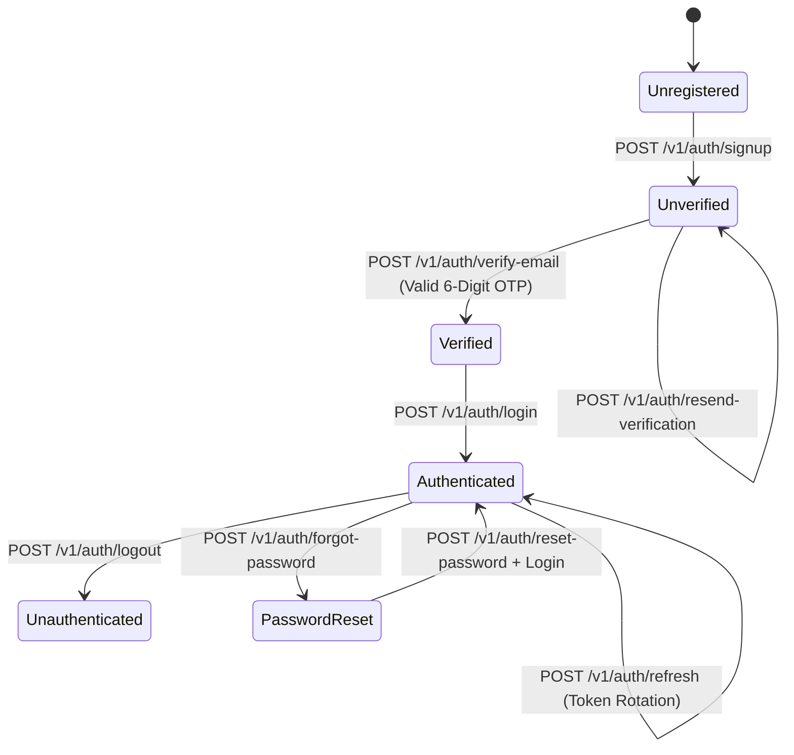

# GymDeck Authentication Flow & API Specification

## 1. Authentication Lifecycle State Machine



---

## 2. API Endpoint Specification

### `POST /v1/auth/signup`
* **Request**:
  ```json
  {
    "email": "sarah.connor@gymdeck.com",
    "password": "Password123!",
    "fullName": "Sarah Connor",
    "phone": "+15551234567",
    "gymId": "optional-uuid"
  }
  ```
* **Response (201 Created)**:
  ```json
  {
    "success": true,
    "data": {
      "email": "sarah.connor@gymdeck.com",
      "message": "Account created successfully. Please enter the 6-digit verification code sent to your email.",
      "requiresVerification": true
    }
  }
  ```

### `POST /v1/auth/verify-email`
* **Request**:
  ```json
  {
    "email": "sarah.connor@gymdeck.com",
    "code": "584920"
  }
  ```
* **Response (200 OK)**:
  ```json
  {
    "success": true,
    "data": {
      "user": {
        "id": "acc_uuid",
        "memberId": "mem_uuid",
        "gymId": "gym_uuid",
        "email": "sarah.connor@gymdeck.com",
        "fullName": "Sarah Connor",
        "phone": "+15551234567",
        "emailVerified": true,
        "role": "MEMBER"
      },
      "tokens": {
        "accessToken": "eyJhbGciOi...",
        "refreshToken": "7c98f3b2...",
        "expiresIn": 900
      }
    }
  }
  ```

### `POST /v1/auth/login`
* **Request**:
  ```json
  {
    "email": "sarah.connor@gymdeck.com",
    "password": "Password123!"
  }
  ```
* **Response (200 OK)**:
  ```json
  {
    "success": true,
    "data": {
      "user": { ... },
      "tokens": {
        "accessToken": "eyJhbGciOi...",
        "refreshToken": "4a18c9e0...",
        "expiresIn": 900
      }
    }
  }
  ```

### `POST /v1/auth/refresh`
* **Request**:
  ```json
  {
    "refreshToken": "4a18c9e0..."
  }
  ```
* **Response (200 OK)**:
  ```json
  {
    "success": true,
    "data": {
      "accessToken": "eyJhbGciOi...",
      "refreshToken": "9d81bf3a...",
      "expiresIn": 900
    }
  }
  ```
