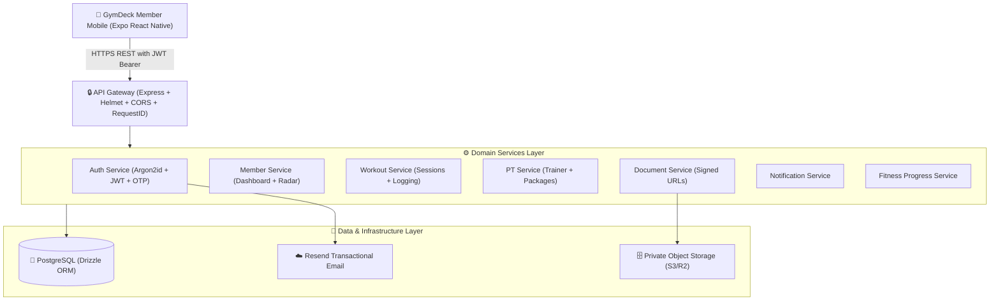

# GymDeck Cloud Backend Architecture Specification

## 1. System Overview
The **GymDeck Cloud Backend** is the authoritative cloud gateway and business logic authority servicing the **GymDeck Member Mobile** application and future cloud synchronization pipelines.



---

## 2. Directory Architecture & Service Boundaries

```
backend/
├── gateway/                 # Public API ingress & routing layer
│   └── src/
│       ├── app.ts           # Express application setup
│       ├── server.ts        # Server bootstrap & graceful lifecycle
│       ├── middleware/      # RequestId, CORS, ErrorHandler, NotFoundHandler
│       └── routes/          # Health and API route registrations
├── services/                # Domain business logic modules
│   ├── auth/                # Sign up, OTP verification, login, refresh tokens
│   ├── member/              # Profile, gym linking, aggregated dashboard
│   ├── workout/             # Live tracking, exercise sets, volume calculation
│   ├── membership/          # Plans, tenure radar, benefits
│   ├── pt/                  # Trainer profile, session ledger
│   ├── documents/           # Document vault, signed URL generation
│   ├── notifications/       # In-app feed and broadcast dispatch
│   └── progress/            # Body weight, measurements, milestones
├── shared/                  # Shared cross-cutting modules
│   ├── config/              # Strongly typed Zod environment configuration
│   ├── database/            # PostgreSQL connection pool & Drizzle client
│   ├── errors/              # Centralized AppError hierarchy
│   ├── logging/             # Redacting structured JSON logger
│   ├── security/            # Cryptographic token hashing & OTP generation
│   ├── types/               # API response envelopes & user claims
│   └── validation/          # Reusable Zod request validator middleware
├── workers/                 # Async background tasks & cleanup jobs
│   └── src/
└── test/                    # Automated infrastructure verification tests
```

---

## 3. Request Lifecycle & Middleware Pipeline

1. **Ingress & Security Headers**: `helmet()` sets standard HTTP security headers (HSTS, CSP, X-Content-Type-Options).
2. **CORS Validation**: Strictly enforces allowed origins from `config.CORS_ORIGINS`.
3. **Correlation Tracking**: `requestIdMiddleware` attaches or generates `x-request-id` header for end-to-end tracing.
4. **Body Parsing**: Parses JSON payloads with a strict 1 MB size limit.
5. **Request Logging**: Redacts sensitive fields (`password`, `token`, `otp`, `authorization`) before outputting structured JSON logs.
6. **Request Validation**: `validateBody()` / `validateQuery()` runs Zod schemas and returns normalized `422 Unprocessable Entity` on failure.
7. **Multi-Tenant Scoping**: All member queries bind `WHERE gym_id = :gymId AND member_id = :memberId` from verified JWT claims.
8. **Error Handling**: `errorHandler` catches operational errors and masks 500 internals in production.

---

## 4. Multi-Tenant Data Isolation Principle
* **Tenancy Root**: `gyms.id` (Tenant UUID).
* **Member Identity**: `gym_members.id` (Member UUID).
* **Strict Compound Scoping**:
  $$\forall \text{ query } Q \in \text{MemberDomain}, \quad Q \implies \text{WHERE } \text{gym\_id} = \text{claim.gymId} \land \text{member\_id} = \text{claim.memberId}$$
* **No Direct Object Exposure**: Resource IDs are never queried in isolation, preventing Insecure Direct Object References (IDOR).

---

## 5. Security & Secret Management Invariants
1. **Server-Side Resend Key**: `RESEND_API_KEY` is loaded exclusively into backend memory. **It is never packaged in mobile application bundles**.
2. **Zero Plaintext Secrets**: Passwords use **Argon2id**; OTPs and refresh tokens use **SHA-256** hashes.
3. **Private Document Storage**: Object storage buckets are private; member access is mediated by short-lived signed URLs (10-minute TTL).
4. **Graceful Shutdown**: Server drains PostgreSQL connection pools on `SIGTERM` / `SIGINT` to prevent data corruption.
