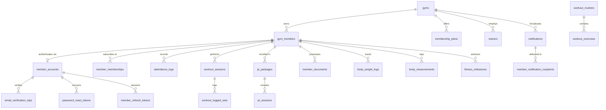

# GymDeck Cloud Database Specification & Schema Reference

## 1. Entity Relationship Overview



---

## 2. Multi-Tenant Data Isolation Strategy
* **Root Tenant**: `gyms.id` (UUIDv4).
* **Tenant Scoping**: All member resources enforce a compound ownership constraint:
  $$\text{gym\_id} = \text{claim.gymId} \land \text{member\_id} = \text{claim.memberId}$$
* **Query Invariant**: No member resource can be retrieved by primary key alone. Queries always bind tenant and member foreign keys:
  ```sql
  SELECT * FROM member_documents WHERE id = :id AND gym_id = :gymId AND member_id = :memberId;
  ```

---

## 3. Schema Definitions & Table Indexing

### 3.1 Core Tenancy & Identity
* **`gyms`**: Root tenant container. Unique index on `code` (e.g. `GD-HQ`).
* **`gym_members`**: Physical gym member profile. Unique index on `(gym_id, member_code)` and indexes on `phone` and `email`.
* **`member_accounts`**: Digital authentication account. Global unique index on `email`. Password stored as **Argon2id hash**.

### 3.2 Authentication Lifecycle
* **`email_verification_otps`**: Stores SHA-256 hashed 6-digit OTPs with 10-minute expiration and max attempt count.
* **`password_reset_tokens`**: Stores SHA-256 hashed recovery tokens with 15-minute expiration.
* **`member_refresh_tokens`**: Stores SHA-256 hashed refresh tokens with UUID `family_id` for token rotation and reuse detection.

### 3.3 Memberships & Attendance
* **`membership_plans`**: Plan pricing, duration in days, and active status.
* **`member_memberships`**: Member subscription tenure, start/end dates, and status (`ACTIVE`, `EXPIRED`, `FROZEN`).
* **`attendance_logs`**: Check-in events with timestamp, entry method (`QR_DYNAMIC`), and device metadata.

### 3.4 Workout Tracking
* **`workout_routines`**: Workout routines assigned by trainers or templates.
* **`workout_exercises`**: Exercise items with target sets, reps, and suggested weight.
* **`workout_sessions`**: Live workout records with `total_volume_kg`, duration, and **`idempotency_key` unique index**.
* **`workout_logged_sets`**: Individual set performance with weight (kg), reps, and completion flags.

### 3.5 Personal Training (PT)
* **`trainers`**: Coach profiles with bio, accreditation, rating, and specializations.
* **`pt_packages`**: PT credit allocations tracking `total_sessions`, `used_sessions`, and `remaining_sessions`.
* **`pt_sessions`**: 1-on-1 session records with date, duration, focus area, and coach notes.

### 3.6 Document Vault
* **`member_documents`**: Metadata-only table storing S3/R2 `object_key`, mime type, and file size. **No binary blobs in PostgreSQL**.

### 3.7 Notifications & Progress
* **`notifications`** & **`member_notification_recipients`**: Fan-out notification feed with unread state tracking (`is_read`, `read_at`).
* **`body_weight_logs`**: Chronological weight logs with calculated BMI.
* **`body_measurements`**: Circumference measurements (chest, waist, arms, thighs, hips) in cm.
* **`fitness_milestones`**: Earned member achievement badges.
* **`audit_logs`**: Immutable audit logs with redacted metadata.

---

## 4. Foreign Key & Destructive Action Strategy
* **Tenant Root Deletion**: Deleting a `gym` cascades to all associated members and records (`ON DELETE CASCADE`).
* **Member Account Deletion**: Deleting a digital `member_account` removes only authentication tokens; physical `gym_members` records are preserved.
* **Plan Deletion**: Deleting a `membership_plan` is restricted if active member subscriptions exist (`ON DELETE RESTRICT`). Soft deletion (`deleted_at`) is preferred.

---

## 5. Timestamp Strategy
* All timestamps use **PostgreSQL `TIMESTAMP WITH TIME ZONE` (`timestamptz`)**.
* Application and database layers store all timestamps in **UTC**.
* Conversion to local timezone occurs on the mobile client using the device's locale.

---

## 6. Desktop vs Cloud Database Separation
* **Desktop Database**: Local embedded SQLite with SQLCipher encryption, serving single-gym receptionists.
* **Cloud Database**: Multi-tenant PostgreSQL with Drizzle ORM, serving mobile members and cloud gateways.
* **Synchronization**: A future synchronization adapter will bridge local SQLite transactions with the cloud database.
