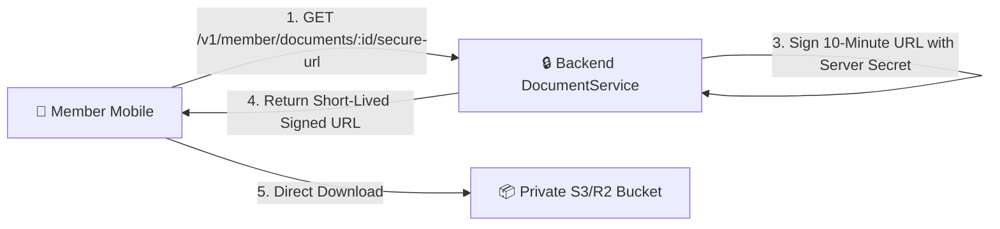

# GymDeck Private Document Vault Architecture

## 1. Overview
The Document Vault stores member agreements, liability waivers, tax invoices, and medical clearance certificates in private object storage (AWS S3 or Cloudflare R2).

---

## 2. Security & Zero-Leakage Policy
1. **Private Bucket**: Buckets allow zero public read access.
2. **Short-Lived Signed URLs**: Download URLs expire in **600 seconds (10 minutes)**.
3. **No Credential Exposure**: Storage access keys and bucket secrets are never sent to mobile or web clients.
4. **Audit Logging**: Every document URL generation event is recorded in `audit_logs` without logging the signed URL itself.
