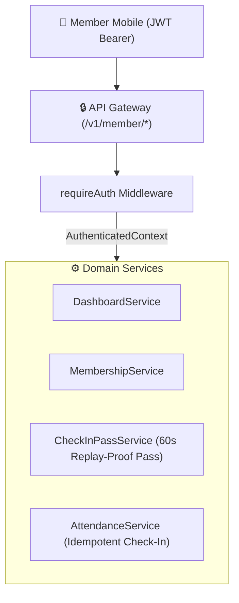

# GymDeck Member Domain API Specification

## 1. Overview
The **Member Domain API** provides core operational endpoints servicing the authenticated member experience in **GymDeck Member Mobile**.

All routes are mounted under `/v1/member/*` and require an authenticated member context (`Authorization: Bearer <accessToken>`).



---

## 2. Security & Tenant Isolation Model
* **Authoritative Context**: `req.user` (`AuthenticatedContext: { memberAccountId, memberId, gymId, role }`).
* **Query Binding**: Every database query explicitly binds:
  $$\text{WHERE } \text{gym\_id} = \text{req.user.gymId} \land \text{member\_id} = \text{req.user.memberId}$$
* **Zero Client Trust**: Query parameters like `?member_id=...` or request body `gym_id` are **strictly ignored for authorization**.

---

## 3. API Endpoints Specification

### 3.1 `GET /v1/member/dashboard`
Aggregates member profile, active membership status, attendance streak, and workout summary.

* **Response (200 OK)**:
  ```json
  {
    "success": true,
    "data": {
      "member": {
        "id": "mem_28416d8e-715a-4e89-980b-93f538e1b017",
        "memberCode": "GD-1001",
        "fullName": "Sarah Connor",
        "email": "sarah.connor@gymdeck.com",
        "phone": "+15551234567",
        "profilePhotoUrl": null,
        "gymId": "gym_3fa85f64-5717-4562-b3fc-2c963f66afa6",
        "gymName": "GymDeck Flagship HQ"
      },
      "membership": {
        "id": "mship_uuid",
        "planId": "plan_uuid",
        "planName": "12-Month All Access VIP",
        "status": "ACTIVE",
        "startDate": "2026-01-01T00:00:00.000Z",
        "endDate": "2026-12-31T23:59:59.000Z",
        "daysRemaining": 124,
        "durationDays": 365,
        "price": "599.00",
        "benefits": ["Full Gym Access", "Locker Access", "Sauna & Spa"],
        "autoRenew": false
      },
      "attendanceSummary": {
        "totalCheckInsThisMonth": 14,
        "streakDays": 4,
        "checkedInToday": true,
        "lastCheckIn": "2026-08-29T10:15:00.000Z"
      },
      "todayWorkout": {
        "routineId": "rt_uuid",
        "title": "Hypertrophy Push Routine A",
        "estimatedMinutes": 50,
        "targetMuscles": ["Chest", "Shoulders", "Triceps"]
      },
      "trainer": {
        "id": "tr_uuid",
        "fullName": "Marcus Vance",
        "specialization": "Hypertrophy & Strength Coach",
        "rating": "4.95"
      }
    }
  }
  ```

---

### 3.2 `GET /v1/member/membership`
Retrieves detailed active and historical membership tenure.

* **Response (200 OK)**:
  ```json
  {
    "success": true,
    "data": {
      "id": "mship_uuid",
      "planId": "plan_uuid",
      "planName": "12-Month All Access VIP",
      "status": "ACTIVE",
      "startDate": "2026-01-01T00:00:00.000Z",
      "endDate": "2026-12-31T23:59:59.000Z",
      "daysRemaining": 124,
      "durationDays": 365,
      "price": "599.00",
      "benefits": ["Full Gym Access", "Locker Access", "Sauna & Spa"],
      "autoRenew": false
    }
  }
  ```

---

### 3.3 `GET /v1/member/check-in-pass`
Generates a short-lived (60-second), signed, dynamic QR pass token with replay prevention nonces.

* **Response (200 OK)**:
  ```json
  {
    "success": true,
    "data": {
      "passToken": "eyJhbGciOi...",
      "qrPayload": "eyJhbGciOi...",
      "expiresInSeconds": 60,
      "expiresAt": "2026-08-29T23:05:00.000Z"
    }
  }
  ```

---

### 3.4 `POST /v1/member/check-in`
Submits an attendance check-in event.

* **Headers**: `Idempotency-Key: <UUIDv4>` (Optional, recommended for mobile retry safety)
* **Request Body**:
  ```json
  {
    "passToken": "eyJhbGciOi...",
    "entryMethod": "QR_DYNAMIC"
  }
  ```
* **Response (200 OK)**:
  ```json
  {
    "success": true,
    "data": {
      "attendanceId": "att_uuid",
      "checkInTime": "2026-08-29T23:04:00.000Z",
      "status": "APPROVED",
      "memberName": "Sarah Connor",
      "gymName": "GymDeck Flagship HQ",
      "message": "Check-in approved! Welcome to GymDeck Flagship HQ."
    }
  }
  ```

#### Check-In Rules Enforced:
1. **Membership Validity**: Rejects check-in if membership is `EXPIRED`, `FROZEN`, or `CANCELLED`.
2. **Duplicate Cooldown**: Rejects check-in if member checked in within the last 2 hours.
3. **Idempotency Guarantee**: Retrying the same check-in with the same `Idempotency-Key` returns the cached approved response directly without creating duplicate database rows.

---

### 3.5 `GET /v1/member/attendance`
Retrieves paginated historical attendance records.

* **Query Parameters**: `page` (default 1), `limit` (default 20, max 100).
* **Response (200 OK)**:
  ```json
  {
    "success": true,
    "data": {
      "items": [
        {
          "id": "att_1",
          "checkInTime": "2026-08-29T10:15:00.000Z",
          "checkOutTime": null,
          "entryMethod": "QR_DYNAMIC"
        }
      ],
      "total": 42,
      "page": 1,
      "limit": 20,
      "totalPages": 3
    }
  }
  ```
