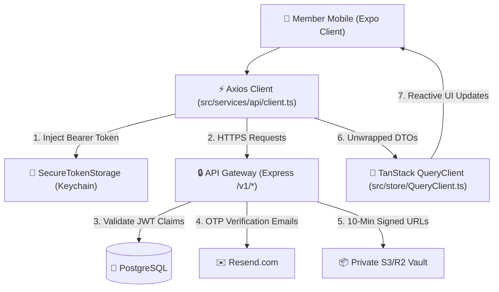

# GymDeck Member Mobile ↔ Cloud Backend Integration Architecture

## 1. Overview & System Topology
Phase 5.2.6 establishes the live end-to-end integration between **GymDeck Member Mobile** (`apps/member-mobile/`) and the **GymDeck Cloud Backend** (`backend/`).

---

## 2. Authentication & Token Management
* **Credentials Storage**: Access tokens and rotating refresh tokens are stored exclusively in **`SecureTokenStorage`** (backed by `react-native-keychain` / native secure enclave).
* **Single-Flight Refresh Mutex**: When multiple concurrent requests encounter a `401 Unauthorized`, the Axios response interceptor pauses all queued requests, initiates a single `POST /v1/auth/refresh` call, updates `SecureTokenStorage`, and replays all paused requests with the new Bearer token.
* **Cache Isolation on Logout**: Invoking `clearSession()` in `useAuthStore` purges Keychain tokens, removes local MMKV user metadata, and immediately executes `queryClient.clear()`, preventing cached member data from persisting across logins.

---

## 3. Real Endpoint Integrations

| Feature Domain | Mobile API Service | Cloud Backend Route | Protocol Highlights |
| :--- | :--- | :--- | :--- |
| **Auth** | `authService.ts` | `POST /v1/auth/*` | Signup, Resend Email OTP verification, Scrypt login, Token rotation, Generic forgot-password |
| **Dashboard** | `memberService.ts` | `GET /v1/member/dashboard` | Aggregated physical profile, active membership, streak, today's workout, assigned coach |
| **Membership** | `memberService.ts` | `GET /v1/member/membership` | Dynamic status derivation (`ACTIVE` vs `EXPIRED`), remaining days, plan benefits |
| **Check-In** | `memberService.ts` | `GET /v1/member/check-in-pass` `POST /v1/member/check-in` | 60-second rotating signed QR pass, 2-hour duplicate cooldown, `Idempotency-Key` header |
| **Attendance** | `memberService.ts` | `GET /v1/member/attendance` | Paginated attendance history logs with limit clamping |
| **Workouts** | `workoutService.ts`| `GET /v1/member/workouts` `POST /v1/member/workout-sessions/*` | Routine exercise ordering, live sets logging, idempotent session completion |
| **Personal Training**| `ptService.ts` | `GET /v1/member/trainer` `GET /v1/member/pt-package` | Trainer certifications/rating, non-negative session math |
| **Document Vault** | `documentService.ts`| `GET /v1/member/documents` `GET /v1/member/documents/:id/secure-url` | Private S3/R2 10-minute signed download URLs, zero credential exposure |
| **Notifications** | `notificationService.ts`| `GET /v1/member/notifications` `POST /v1/member/notifications/:id/read` | Read state toggles, unread summary count |
| **Fitness Progress** | `progressService.ts`| `GET/POST /v1/member/progress/*` | Canonical weight in kg ($30\text{--}300\text{ kg}$), circumference in cm, milestone badges |

---

## 4. Physical Device Development Configuration
When running the Expo client on a physical Android or iOS device:
1. Update `apps/member-mobile/src/config/index.ts` `api.baseUrl` to the development machine's LAN IP (e.g. `http://192.168.1.50:8080`).
2. Run backend via `npm run dev` in `backend/`.
3. Expo Development Builds preserve native `react-native-mmkv` and `react-native-keychain` without falling back to insecure storage mechanisms.
