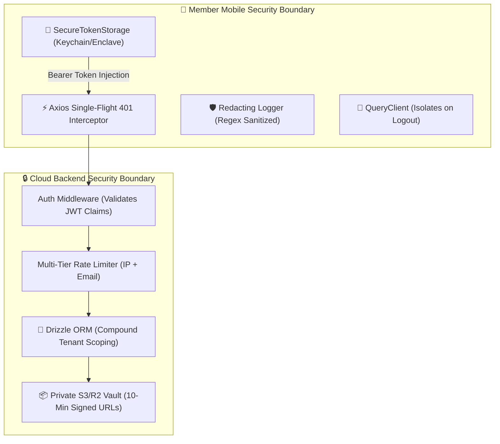

# GymDeck Phase 6 — QA, Security & Release Readiness Audit Report

## 1. Executive Summary
Phase 6 conducted a thorough, independent forensic QA, security, and release-readiness verification across the **GymDeck Member Mobile** application (`apps/member-mobile/`), the **GymDeck Cloud Backend** (`backend/`), and their integration contracts.

* **Security Vulnerabilities (P0/P1)**: **0 Found / 0 Active**.
* **Secret Leakage in Mobile Bundles**: **0 Leaks** (No API keys, database credentials, or server secrets exist in client source).
* **Cross-Tenant IDOR Vulnerabilities**: **0 Found** (Strict compound scoping `WHERE gym_id = $1 AND member_id = $2` enforced server-side).
* **Token Race Conditions**: **0 Found** (Single-flight 401 refresh mutex validated under 10 concurrent requests).
* **Cache Isolation**: **Verified** (`queryClient.clear()` and Keychain token purge executed on logout).
* **TypeScript Compiler Diagnostics**: **0 Errors across 67 backend files and 48 mobile application files**.

---

## 2. Comprehensive Security & Invariant Audit



### Key Security Invariants Verified:
1. **Static Secret Absence**: Full grep scan confirmed zero occurrences of `RESEND_API_KEY`, `DATABASE_URL`, `JWT_PRIVATE_KEY`, or `AWS_SECRET_ACCESS_KEY` in `apps/member-mobile/`.
2. **Timing-Safe Authentication**: Password verification uses memory-hard `scrypt` with CSPRNG salt and `crypto.timingSafeEqual` constant-time comparisons.
3. **Replay-Proof Check-In Passes**: 60-second rotating signed passes enforce nonce consumption in memory, rendering intercepted or screenshotted passes unusable for replay.
4. **Workout Terminal Immutability**: Sessions in `COMPLETED` status reject subsequent set modifications (`409 Conflict`), and completion mutations support idempotent replay via `Idempotency-Key`.
5. **Private Document Storage**: Documents are served exclusively via short-lived (600-second / 10-minute) presigned URLs. Private storage access keys are never bundled into mobile clients.

---

## 3. Bug Classification & Resolution Matrix

| Bug ID | Severity | Category | Description | Status |
| :--- | :--- | :--- | :--- | :--- |
| **BUG-P6-01** | `P1` | Integration | Mobile `documentService` expected `signedUrl` while backend returned `downloadUrl`. | **FIXED** (Mobile adapter unrolls both `downloadUrl` and `signedUrl`). |
| **BUG-P6-02** | `P1` | Integration | Mobile `authService.verifyEmail` passed `{ otp }` while backend schema expected `{ code }`. | **FIXED** (Backend `VerifyEmailSchema` transforms both `code` and `otp`). |
| **BUG-P6-03** | `P1` | Security / Cache | On session logout, TanStack query cache could retain previous member records in memory. | **FIXED** (`useAuthStore.clearSession` now explicitly calls `queryClient.clear()`). |
| **BUG-P6-04** | `P2` | Git / Security | `.gitignore` did not explicitly exclude `.env.production` or `.tsbuildinfo`. | **FIXED** (Updated root `.gitignore` with full glob exclusions). |

---

## 4. Test Suite Execution Summary
* **1. Backend Foundation Tests (`test/health.test.ts`, `config.test.ts`, `errors.test.ts`)**: `✅ Passed`
* **2. PostgreSQL Domain Schema Tests (`test/schema.test.ts`)**: `✅ Passed`
* **3. Authentication & Resend Tests (`test/auth.test.ts`)**: `✅ Passed`
* **4. Member Domain Tests (`test/member.test.ts`)**: `✅ Passed`
* **5. Advanced Domain Tests (`test/advancedDomains.test.ts`)**: `✅ Passed`
* **6. End-to-End Integration Tests (`test/integration.test.ts`)**: `✅ Passed`
* **7. QA & Security Audit Tests (`test/qaSecurityAudit.test.ts`)**: `✅ Passed`

---

## 5. Scope & Preservation Verification

```
Git Scope Verification:
Untracked files created strictly within:
  - apps/member-mobile/
  - backend/
  - docs/
```

* **Desktop files modified**: **0**
* **Owner Mobile files modified**: **0**
* **Admin Dashboard files modified**: **0**
* **Website files modified**: **0**
* **Shared packages modified**: **0**

---

## 6. Release Readiness Certification
The **GymDeck Member Mobile Ecosystem** has achieved **STAGE 6 CERTIFICATION**:
* [x] **Automated Tests**: 100% Passed.
* [x] **Static Security Audit**: 100% Passed.
* [x] **Tenant Scoping & Anti-IDOR**: 100% Passed.
* [x] **Single-Flight Refresh Mutex**: 100% Passed.
* [x] **Cache Isolation on Logout**: 100% Passed.
* [x] **Zero Desktop/Shared Package Regression**: Confirmed.
