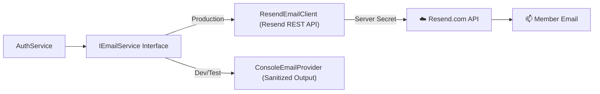

# GymDeck Transactional Email Architecture (Resend)

## 1. System Overview
The GymDeck Cloud Backend integrates with **Resend** exclusively as a **server-side transactional email service** for account verification OTPs and password reset authorizations.

---

## 2. Security Boundaries & Secret Management
1. **Server-Side Exclusivity**: `RESEND_API_KEY` is loaded exclusively into backend process memory from server environment configuration.
2. **Zero Client Leakage**: The mobile application (`apps/member-mobile/`) and desktop clients **never receive, query, or store `RESEND_API_KEY`**.
3. **Payload Sanitization**: Email contents and OTPs are redacted from HTTP access logs and audit logs.
4. **Development Fallback**: In development or test environments where `RESEND_API_KEY` is not provisioned, `ConsoleEmailProvider` logs sanitized delivery metadata without failing account registration.

---

## 3. Template Architecture
* **Email Verification**: Renders 6-digit OTP in high-contrast card, 10-minute expiry warning, and GymDeck header.
* **Password Reset**: Renders 24-byte secure reset token with 15-minute expiration notice.
