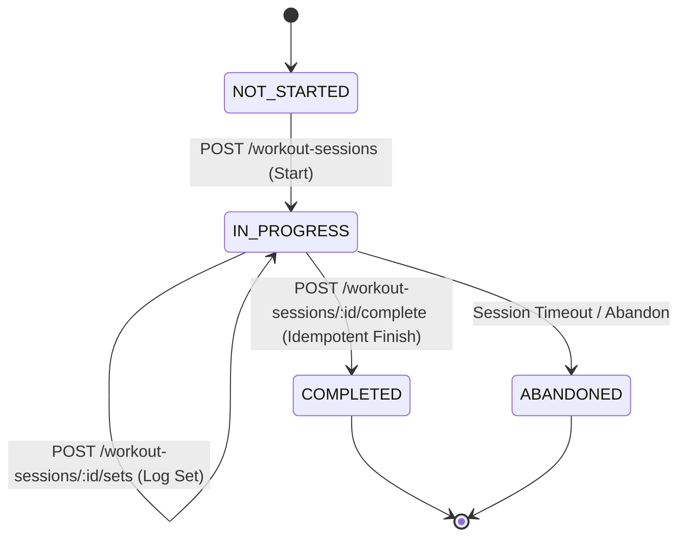

# GymDeck Workout Domain Architecture

## 1. Overview
The Workout Domain enables authenticated gym members to view assigned training routines, launch live workout tracking sessions, log individual exercise sets, and idempotently complete training sessions with volume tracking.

---

## 2. API Endpoints
* `GET /v1/member/workouts`: Retrieves assigned workout routines with ordered exercises.
* `POST /v1/member/workout-sessions`: Starts a live workout session.
* `POST /v1/member/workout-sessions/:sessionId/sets`: Logs individual sets (weight, reps, completion flag).
* `POST /v1/member/workout-sessions/:sessionId/complete`: Completes session with idempotency key support.
* `GET /v1/member/workout-history`: Paginated completed workout sessions.

---

## 3. Idempotency & Concurrency Invariants
* **Key Format**: Client sends `Idempotency-Key: <UUID>` header on completion.
* **Cached Replay**: Retrying completion with the same idempotency key returns the cached completed payload without re-running database mutations.
* **Terminal Immutability**: Once a session reaches `COMPLETED`, subsequent set mutations are rejected with `409 Conflict`.
