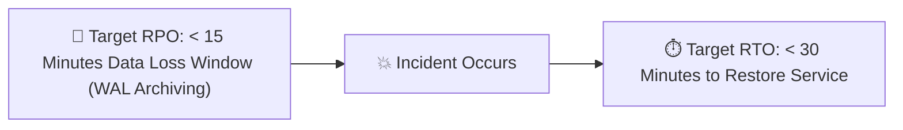

# GymDeck Disaster Recovery & Data Protection Protocol

## 1. Recovery Objectives (Target RPO & RTO)



* **Target Recovery Point Objective (RPO)**: **$< 15\text{ minutes}$** (Architectural target via Continuous WAL Archiving + Automated Daily Snapshots).
* **Target Recovery Time Objective (RTO)**: **$< 30\text{ minutes}$** (Architectural target via Containerized Infrastructure and Automated Migration Rollforward).
* **Validation Status**: **`NOT YET PROVEN`** (Desktop staging restore is verified; cloud multi-tenant failover has not yet been empirically timed in a production cluster).

---

## 2. PostgreSQL Backup Strategy

### A. Snapshot Frequency & Retention
* **Daily Full Logical Backups**: Automated `pg_dump` executed at `02:00 UTC` with AES-256 encryption.
* **Continuous WAL Archiving**: Point-In-Time Recovery (PITR) enabled via pgBackRest or cloud managed WAL storage.
* **Retention Schedule**:
  * Daily snapshots retained for **30 days**.
  * Weekly snapshots retained for **12 weeks**.
  * Monthly snapshots retained for **12 months**.

### B. Backup Command Specification
```bash
# Encrypted Daily Backup Execution
pg_dump -h $DB_HOST -U $DB_USER -d $DB_NAME -Fc | \
  openssl enc -aes-256-cbc -salt -pbkdf2 -out /backups/gymdeck_backup_$(date +%Y%m%d_%H%M%S).dump.enc -pass pass:$BACKUP_ENCRYPTION_KEY
```

---

## 3. Database Restore Procedure

1. **Provision Fresh PostgreSQL Instance**:
   ```bash
   docker-compose -f infrastructure/docker/docker-compose.prod.yml up -d postgres
   ```
2. **Decrypt Snapshot**:
   ```bash
   openssl enc -d -aes-256-cbc -pbkdf2 -in /backups/gymdeck_backup_TARGET.dump.enc -out /tmp/restore.dump -pass pass:$BACKUP_ENCRYPTION_KEY
   ```
3. **Restore Database Structure & Data**:
   ```bash
   pg_restore -h localhost -U gymdeck_prod_user -d gymdeck_cloud_prod --clean --if-exists /tmp/restore.dump
   ```
4. **Execute Migration Rollforward**:
   ```bash
   npm run db:migrate
   ```
5. **Verify Database Health**:
   ```bash
   curl -I https://api.gymdeck.com/ready
   ```

---

## 4. Private Document Vault (S3/R2) Recovery
* **Cross-Region Replication**: Storage bucket configured with automatic cross-region replication.
* **Versioned Objects**: Invoices, agreements, and waivers stored with object versioning enabled to prevent accidental deletion or ransomware alteration.
