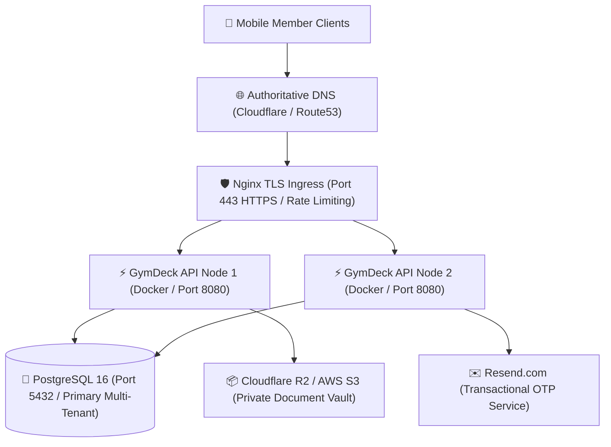

# GymDeck Production Deployment & Infrastructure Specification

## 1. Production Domain & DNS Architecture

The production and staging environments require the following DNS records configured with your authoritative DNS registrar (e.g. Cloudflare / AWS Route53):

| Hostname / Record | Type | Target / Value | Purpose |
| :--- | :---: | :--- | :--- |
| `api.gymdeck.com` | `A` / `CNAME` | `<Production-Load-Balancer-IP>` | Primary Mobile & Cloud API Gateway |
| `staging-api.gymdeck.com` | `A` / `CNAME` | `<Staging-Load-Balancer-IP>` | Pre-Release Verification Environment |
| `gymdeck.com` (Apex) | `A` | `<Web-Cluster-IP>` | Marketing & Member Web Portal |
| `_dmarc.gymdeck.com` | `TXT` | `v=DMARC1; p=reject; rua=mailto:dmarc@gymdeck.com` | Email DMARC Protection |
| `resend._domainkey` | `TXT` | `k=rsa; p=<RESEND_DKIM_PUBLIC_KEY>` | Resend DKIM Signature |
| `gymdeck.com` (SPF) | `TXT` | `v=spf1 include:amazonses.com include:resend.com ~all` | Sender Policy Framework (SPF) |

---

## 2. Infrastructure Deployment Topology



---

## 3. Production Deployment Step-by-Step

### Step 1: Server Provisioning & Docker Setup
```bash
git clone <authorized-repo-url> gymdeck
cd gymdeck/infrastructure/docker
```

### Step 2: Configure Production Environment Variables
Create `.env` inside `infrastructure/docker/` populated with secrets from the organization secret manager.

### Step 3: Run Database Migrations
```bash
docker-compose -f docker-compose.prod.yml run --rm backend npm run db:migrate
```

### Step 4: Launch Production Cluster
```bash
docker-compose -f docker-compose.prod.yml up -d
```

### Step 5: Validate Deployment Health
```bash
curl -f https://api.gymdeck.com/health
curl -f https://api.gymdeck.com/ready
```

---

## 4. Zero-Downtime Rollback Procedure

If unexpected defects or database anomalies occur post-deployment:
1. **Revert Container Image**:
   ```bash
   docker-compose -f docker-compose.prod.yml down
   docker-compose -f docker-compose.prod.yml up -d --build backend
   ```
2. **Revert Migrations (if non-destructive)**:
   ```bash
   npm run db:migrate:rollback
   ```
3. **Validate Readiness**:
   ```bash
   curl -f https://api.gymdeck.com/ready
   ```
