# GymDeck Final+Demo Directory Structure

This document outlines the folder and file structures of the **GymDeck Final+Demo** directory located at `/Users/subhamdas/Documents/GymDeck Final+Demo`.

## Visual Folder Structure Diagram

```mermaid
graph TD
    Root["📁 GymDeck Final+Demo"]
    
    %% Main Subdirectories
    Desktop["📁 GymDeck_Desktop (Tauri Desktop App)"]
    Mobile["📁 member-mobile (Expo React Native App)"]
    Owner["📁 owner-mobile (Placeholder)"]
    Web["📁 website (Placeholder)"]
    
    Root --> Desktop
    Root --> Mobile
    Root --> Owner
    Root --> Web
    
    %% Desktop Details
    Auth["📁 authentication (HTML Login Pages)"]
    Front["📁 frontend (React modules)"]
    Rust["📁 src-tauri (Rust Container configs)"]
    Public["📁 public (Webworkers & loaders)"]
    Dist["📁 dist (Vite production build output)"]
    ViteConfig["📄 vite.config.js"]
    PackageJson1["📄 package.json"]
    
    Desktop --> Auth
    Desktop --> Front
    Desktop --> Rust
    Desktop --> Public
    Desktop --> Dist
    Desktop --> ViteConfig
    Desktop --> PackageJson1
    
    %% Mobile Details
    MemberApp["📁 member-app (Workspace)"]
    Mobile --> MemberApp
    
    SrcMobile["📁 src (TSX components)"]
    AndroidMobile["📁 android (Gradle native container)"]
    AssetsMobile["📁 assets (Splash / Logos)"]
    AppJson["📄 app.json (Expo configuration)"]
    PackageJson2["📄 package.json"]
    
    MemberApp --> SrcMobile
    MemberApp --> AndroidMobile
    MemberApp --> AssetsMobile
    MemberApp --> AppJson
    MemberApp --> PackageJson2
    
    %% Styles
    classDef dir fill:#eff6ff,stroke:#2563eb,stroke-width:2px,color:#1e3a8a;
    classDef file fill:#f8fafc,stroke:#64748b,stroke-width:1.5px,color:#334155;
    classDef placeholder fill:#faf5ff,stroke:#8b5cf6,stroke-width:1.5px,stroke-dasharray: 5 5,color:#5b21b6;
    
    class Root,Desktop,Mobile,MemberApp,Auth,Front,Rust,Public,Dist,SrcMobile,AndroidMobile,AssetsMobile dir;
    class ViteConfig,PackageJson1,AppJson,PackageJson2 file;
    class Owner,Web placeholder;
```



---

## Folder Tree Navigation

```
GymDeck Final+Demo/
├── GymDeck_Desktop/      # Tauri Desktop Client (Vite + React + Rust)
├── member-mobile/        # Expo React Native App for Gym Members
├── owner-mobile/         # [Placeholder] Owner App Mobile Repo
└── website/              # [Placeholder] Marketing/Commercial Site
```

---

### 1. GymDeck_Desktop
The main desktop management dashboard interface, built as a Tauri desktop application container.

* **`authentication/`**: HTML & JS assets for client login/signup/OTP screens.
* **`frontend/`**: Single Page React Application dashboards (e.g. `PastMembers.jsx` retention cohort, `AppSettings.jsx` settings).
* **`src-tauri/`**: Tauri desktop configuration & Rust backend (`Cargo.toml`, drivers, SQLite security credentials).
* **`public/`**: Static assets & Web workers (PDF engine, service workers).
* **`dist/`**: Production compiled client distribution bundles.

---

### 2. member-mobile
The cross-platform React Native member-facing mobile client repository.

* **`member-app/`**: Expo React Native App Workspace.
  * **`android/`**: Native Android build container.
  * **`assets/`**: Splash screens, app icons, typography.
  * **`src/`**: TSX React Native codebase files.
  * **`app.json`**: Core Expo config settings.
